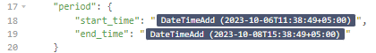
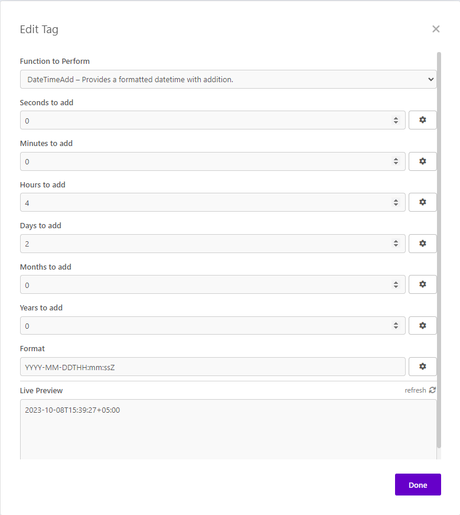

# DateTime Add

[based on SebBrookfield/DateAdd](https://github.com/SebBrookfield/DateAdd)

DateTime Add is an Insomnia plugin that allows you to take the current date, add years/months/days/hours/minutes/seconds, and output in a specific format.
This plugin uses the [momentjs](https://momentjs.com) library for manipulating the dates.

### Parameters

The parameters are pretty self explanatory.
The numeric parameters can also be negative.

##### Seconds to add

The number of seconds to add to the current time.

##### Minutes to add

The number of minutes to add to the current time.

##### Hours to add

The number of hours to add to the current time.

##### Days to add

The number of days to add to the current date.

##### Months to add

The number of months to add to the current date.

##### Years to add

The number of years to add to the current date.

##### Format

This is the format string for outputting the date.
You can read more about formatting momentjs dates in the following documentation.
https://momentjs.com/docs/#/displaying
